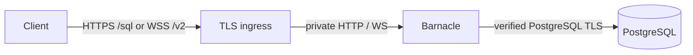
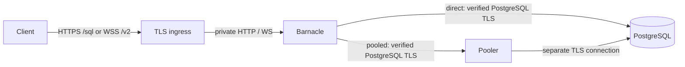
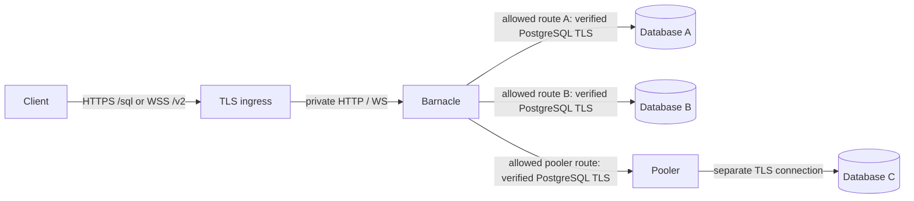

# Deploy Barnacle

Barnacle adds SQL over HTTP (`/sql`) and PostgreSQL sessions over WebSocket (`/v2`) to an existing PostgreSQL setup. It can run beside one PostgreSQL instance, beside PostgreSQL and its pooler, or as a separate gateway that reaches several instances. Each HTTP request opens one upstream connection; each WebSocket session keeps one open.

Choose the layout that matches where Barnacle runs:

- **One PostgreSQL instance:** set `BARNACLE_PG_ADDR` to its private `host:port` and leave `BARNACLE_PG_ALLOWED_ADDRS` empty.
- **PostgreSQL and its pooler:** put both addresses in `BARNACLE_PG_ALLOWED_ADDRS` so clients can choose the direct or pooled path.
- **Several instances:** list each approved PostgreSQL or pooler address in `BARNACLE_PG_ALLOWED_ADDRS`.

### How requests choose PostgreSQL

`BARNACLE_PG_ADDR` is an upstream PostgreSQL `host:port`, not Barnacle's public URL. Native and Neon-compatible routes use it. `BARNACLE_LISTEN` controls where Barnacle itself accepts HTTP and WebSocket connections.

- **Without `BARNACLE_PG_ALLOWED_ADDRS`:** `BARNACLE_PG_ADDR` is the fixed destination. `/sql` still requires a connection URL for the database and a credential in the URL or `Authorization` header, but ignores the URL host for routing. `/v2` ignores `?address=` and relays the client's PostgreSQL login to the fixed destination.
- **With `BARNACLE_PG_ALLOWED_ADDRS`:** `/sql` selects the upstream from the host and port in its connection URL; `/v2` selects it from `?address=host:port`. Barnacle accepts only listed addresses. `BARNACLE_PG_ADDR` becomes the fallback when a request gives no address and must itself appear in the allowlist. Leave it empty to require every client to select a destination.

For example, with `BARNACLE_PG_ALLOWED_ADDRS=postgres:5432,pgbouncer:6432` and `BARNACLE_PG_ADDR=pgbouncer:6432`, an HTTP connection string naming `postgres:5432` uses the direct path, `/v2?address=postgres:5432` does the same, and a WebSocket without `?address=` uses the pooler. The local Compose file supplies `BARNACLE_PG_ADDR=postgres:5432` unless you set `BARNACLE_PG_ADDR=` explicitly.

Put an HTTPS/WSS ingress in front of Barnacle and keep PostgreSQL and pooler listeners private. The supplied [HAProxy example](../haproxy.cfg) shows TLS termination for Barnacle.

## One PostgreSQL instance

Barnacle and PostgreSQL can run on one host or in adjacent containers. On one host, Barnacle might use `127.0.0.1:5432`; in Compose, use a service name such as `postgres:5432` because `localhost` refers to the Barnacle container.

```sh
BARNACLE_PG_ADDR=postgres:5432
BARNACLE_PG_ALLOWED_ADDRS=
BARNACLE_PG_SSLMODE=require
BARNACLE_PG_CA_FILE=/etc/barnacle/pg-ca.pem
```



Clients still send a PostgreSQL connection string with their user, database, and credential. With a fixed destination, the URL's host does not select a different server. See [authentication](authentication.md) for password and bearer-token modes.

## PostgreSQL and its pooler

When clients need both routes, allow the direct PostgreSQL address and the pooler address. The example gives requests without a selected address a pooled fallback; leave `BARNACLE_PG_ADDR` empty if every client must choose explicitly.

```sh
BARNACLE_PG_ALLOWED_ADDRS=postgres:5432,pgbouncer:6432
BARNACLE_PG_ADDR=pgbouncer:6432
BARNACLE_PG_SSLMODE=require
BARNACLE_PG_CA_FILE=/etc/barnacle/pg-ca.pem
```



The client's HTTP connection-string host or WebSocket `?address=` selects one route. A client with valid database credentials can choose the direct path and bypass the pooler; if that should be forbidden for some clients, use separate Barnacle instances with different ingress and authentication policies. Size `BARNACLE_MAX_CONNECTIONS` and the pooler against PostgreSQL's connection budget.

Use the direct path or session pooling for WebSocket clients that rely on `SET`, temporary tables, or other session state. Transaction pooling suits stateless HTTP queries and batches; statement pooling cannot run Barnacle's transactional HTTP batches. See [PgBouncer's feature matrix](https://www.pgbouncer.org/features.html). Barnacle's default `BARNACLE_PG_QUERY_EXEC_MODE=exec` avoids named prepared statements in HTTP queries. If you set `cache_statement`, check the pooler's named-statement support. A pooler authenticates clients and has its own separate TLS connection to PostgreSQL; verify both legs.

## Several PostgreSQL instances

A separate Barnacle can reach several PostgreSQL instances or poolers across a private network. List each permitted destination explicitly:

```sh
BARNACLE_PG_ALLOWED_ADDRS=db-a.internal:5432,db-b.internal:5432,pool-c.internal:6432
BARNACLE_PG_ADDR=
BARNACLE_PG_SSLMODE=require
BARNACLE_PG_CA_FILE=/etc/barnacle/pg-ca.pem
```

For HTTP, the host and port in `Neon-Connection-String` select one allowed destination. For WebSocket, the driver sends `?address=host:port` when `neonConfig.wsProxy` is a string. A missing or unlisted destination is rejected. You may set `BARNACLE_PG_ADDR` to one of the listed addresses as a fallback; otherwise leave it empty. Each request or WebSocket session connects to **one** destination. Barnacle does not join data or run a transaction across instances.

```js
neonConfig.fetchEndpoint = 'https://barnacle.example.com/sql';
neonConfig.wsProxy = 'barnacle.example.com/v2';
```



Each request selects one arrow out of Barnacle; the allowlist does not make a cross-database query.

The requested address must match an allowlist entry exactly, including its port; HTTP uses port `5432` when the URL omits one. The allowlist controls destinations, not which user may reach each one. If user groups need different database access or one group may bypass a pooler, use separate Barnacle instances with separate ingress and authentication policies. Database credentials and roles still determine what a connected client can do.

### TLS on each connection

- **Client to ingress:** use HTTPS and WSS. The [HAProxy example](../haproxy.cfg) terminates this TLS connection. Barnacle itself listens on HTTP/WS, so keep the ingress-to-Barnacle hop private and restrict direct access. If that hop crosses an untrusted network, terminate TLS again beside Barnacle or use an encrypted network tunnel.
- **Barnacle to PostgreSQL or pooler:** keep `BARNACLE_PG_SSLMODE=require` when traversing a network. Barnacle verifies the certificate chain and the destination hostname, like libpq's [`verify-full`](https://www.postgresql.org/docs/current/libpq-ssl.html); this is stricter than libpq's `require`. Use a DNS name on the certificate and provide its CA through `BARNACLE_PG_CA_FILE` or `BARNACLE_PG_EXTRA_CA_FILE` if it is not already trusted. `disable` is available for a trusted local hop, such as loopback.
- **Pooler to PostgreSQL:** configure this separately. For PgBouncer, use [`server_tls_sslmode=verify-full` and `server_tls_ca_file`](https://www.pgbouncer.org/config.html); Barnacle's settings protect only its connection to the pooler. On the Barnacle-facing side, configure PgBouncer's `client_tls_sslmode=require` and a certificate and key for the name Barnacle dials.
- **Several routed instances:** each certificate must match its allowlisted DNS name. `BARNACLE_PG_TLS_SERVER_NAME` overrides the verification name for **every** route; leave it empty when routes have different names. Separate Barnacle instances are needed when routes require different TLS modes or a shared name override is unsuitable. Barnacle has no upstream client-certificate setting, so an upstream requiring mutual TLS client authentication needs a different arrangement.

The WebSocket client sends PostgreSQL wire messages inside WSS; Barnacle then starts its own verified TLS connection upstream. Keep the Neon driver's `forceDisablePgSSL=true` default for this arrangement; Barnacle does not forward an inner PostgreSQL TLS handshake inside WebSocket. See [driver configuration](https://github.com/neondatabase/serverless/blob/main/CONFIG.md).

The local [Compose stack](../compose.yaml) uses `BARNACLE_PG_ALLOWED_ADDRS=*` only so its optional debug console can try arbitrary hosts. Do not use `*` for a shared or public gateway: it lets a caller direct Barnacle to any reachable `host:port`. An allowlist is also not a firewall; restrict Barnacle's network egress to the approved databases and any OIDC issuer, and restrict database ingress to expected clients. DNS resolution and network policy determine the actual IPs reached.

## Ingress, browser access, and operations

- Terminate HTTPS/WSS at the ingress and keep Barnacle's own listener private. Preserve the public `Host`. If the ingress sets `X-Forwarded-Proto`, set `BARNACLE_TRUSTED_PROXIES` to its immediate source IP or CIDR; Barnacle ignores that header from other peers. For a separate browser frontend, set exact origins in `BARNACLE_ALLOWED_ORIGIN`.
- Keep credentials in connection strings and bearer tokens out of access logs. The optional console is a development service, not part of a production deployment.
- Metrics are off unless `BARNACLE_METRICS=true`. When enabled, `/metrics` listens on `127.0.0.1:9090` by default, separate from client traffic. The main listener returns `404` for `/metrics`, and the metrics listener serves no other routes.
- The metrics endpoint has no authentication. For a remote scraper, set `BARNACLE_METRICS_LISTEN` to a private interface and restrict access with a firewall or private ingress. The supplied HAProxy example also returns `404` for public `/metrics` requests.
- In Compose, the metrics listener binds to `:9090` inside the Barnacle container and is not published on the host. The optional console proxies `/metrics` to that port. Keep the port at `9090` when using the console's Metrics view.
- The [HAProxy example](../haproxy.cfg) allows hour-long WebSocket connections and forwards client disconnects. Keep the ingress timeout longer than Barnacle's `BARNACLE_WS_IDLE_TIMEOUT`. If another proxy terminates TLS before HAProxy, normalize the public scheme at that proxy and trust only the immediate proxy at each hop.
- Set `BARNACLE_READY_PG_ADDR` when you want `/readyz` to probe one PostgreSQL TCP/TLS endpoint. It does not authenticate or verify every routed instance. Use target-specific checks if you need readiness for several databases.

For installation on Debian or Fedora, service limits, and key-access setup, see [package operations](operations.md). For the HTTP and WebSocket request formats, see the [API reference](api.md).

## Configuration reference

The development Compose file passes these settings from shell variables or `.env`, except `BARNACLE_LISTEN`, which is fixed to `:8080` for its published port. The packaged services read `/etc/default/barnacle` or `/etc/sysconfig/barnacle`. Put certificates and keys in files and pass their paths; do not put credentials in Barnacle environment variables.

| Variable | Default | Effect |
| --- | --- | --- |
| `BARNACLE_LISTEN` | `:8080` | HTTP and WebSocket listen address |
| `BARNACLE_PG_ADDR` | `127.0.0.1:5432` in fixed mode; unset in routing mode | Fixed destination or optional allowlisted fallback |
| `BARNACLE_PG_ALLOWED_ADDRS` | empty | Allow exact `host:port` routes; `*` permits any destination and is used by local Compose |
| `BARNACLE_PG_SSLMODE` | `require` | Verified upstream TLS; `disable` permits plaintext on a trusted local network |
| `BARNACLE_PG_QUERY_EXEC_MODE` | `exec` | HTTP pgx mode: `exec`, `cache_describe`, or `cache_statement` |
| `BARNACLE_PG_TLS_SERVER_NAME` | empty | Optional certificate name override for every upstream |
| `BARNACLE_PG_CA_FILE` | empty | PEM CA bundle added to system trust roots |
| `BARNACLE_PG_EXTRA_CA_FILE` | empty | Second optional PEM CA bundle |
| `BARNACLE_QUERY_TIMEOUT` | `30s` | HTTP connect and whole-query or batch deadline |
| `BARNACLE_HTTP_READ_TIMEOUT` | `15s` | Time to read an HTTP request, including its body |
| `BARNACLE_HTTP_WRITE_TIMEOUT` | `60s` | HTTP request and response deadline, including query and output |
| `BARNACLE_HTTP_IDLE_TIMEOUT` | `60s` | Idle time between HTTP keep-alive requests |
| `BARNACLE_READY_PG_ADDR` | empty | Optional TCP/TLS endpoint for `/readyz`; no login or SQL |
| `BARNACLE_METRICS` | `false` | `true` starts the separate, unauthenticated metrics listener; other values fail startup |
| `BARNACLE_METRICS_LISTEN` | `127.0.0.1:9090` | Metrics listener `host:port`; used only when `BARNACLE_METRICS=true` |
| `BARNACLE_WS_IDLE_TIMEOUT` | `30m` | Close after this long without client frames or PostgreSQL output |
| `BARNACLE_WS_WRITE_TIMEOUT` | `30s` | Deadline for each WebSocket or upstream write |
| `BARNACLE_MAX_CONNECTIONS` | `32` | Maximum simultaneous HTTP and WebSocket upstream connections; excess gets 503 |
| `BARNACLE_MAX_HTTP_QUERIES` | `8` | Maximum concurrent HTTP queries; excess gets 503 |
| `BARNACLE_HTTP_MAX_ROW_MIB` | `8` | Maximum raw PostgreSQL field data in one HTTP row |
| `BARNACLE_HTTP_MAX_BUFFERED_MIB` | `4` | Buffer limit for a batch or custom-type result |
| `BARNACLE_HTTP_MAX_RESPONSE_MIB` | `128` | Maximum uncompressed HTTP result JSON bytes |
| `BARNACLE_OIDC_ISSUER` | empty | Issuer URL; set with audience to enable the access-token gate |
| `BARNACLE_OIDC_AUDIENCE` | empty | Required resource audience when the gate is enabled |
| `BARNACLE_ALLOWED_ORIGIN` | empty | Comma-separated exact browser origins |
| `BARNACLE_TRUSTED_PROXIES` | empty | Immediate reverse-proxy IPs or CIDRs allowed to set `X-Forwarded-Proto` |

`BARNACLE_QUERY_TIMEOUT` covers a whole HTTP batch, not each statement. `BARNACLE_HTTP_WRITE_TIMEOUT` must leave time to send the response after query work. WebSocket sessions have no whole-session deadline; their idle and per-write limits apply after upgrade. Set PostgreSQL's own `statement_timeout` for database-side query limits.

## Before serving traffic

1. Confirm the ingress reaches `/sql` and `/v2` and does not log credentials. Check browser Origin behavior through the real proxy chain.
2. Try an unlisted database address. Fixed mode must still use its configured destination; routed mode must reject it.
3. Verify every allowed destination's TLS name and CA, and test the pooler-to-PostgreSQL TLS leg separately if used.
4. Check database roles, connection budgets, query timeouts, and a long-lived WebSocket session with the intended pool mode.
5. Confirm network rules block Barnacle from unrelated database IPs and block untrusted clients from reaching PostgreSQL or the pooler.
