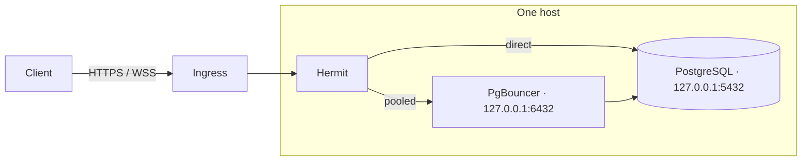

# Deployment modes and upstream boundaries

Hermit serves HTTP (`/sql`) and WebSocket (`/v2`) on one listener. Put an HTTPS/WSS ingress in front of that listener and keep PostgreSQL and PgBouncer on private addresses. There are two independent choices: **where the services run** (one host, adjacent containers, or separate private hosts) and **whether clients can select an upstream** (fixed or allowlisted). A same-host deployment can still offer both the direct and pooled paths.

Run shell examples from the repository root.

| Upstream choice | Settings | Same-host example | Container example |
| --- | --- | --- | --- |
| Direct only | Set `HERMIT_PG_ADDR`; leave `HERMIT_PG_ALLOWED_ADDRS` empty | `127.0.0.1:5432` | `postgres:5432` |
| Pooler only | Set `HERMIT_PG_ADDR` to PgBouncer or another pooler; leave the allowlist empty | `127.0.0.1:6432` | `pgbouncer:6432` |
| Direct **and** pooled | List both addresses in `HERMIT_PG_ALLOWED_ADDRS`; optionally set `HERMIT_PG_ADDR` to one listed address as the default | `127.0.0.1:5432,127.0.0.1:6432` | `postgres:5432,pgbouncer:6432` |



PgBouncer and PostgreSQL can run on that same host and bind different loopback ports; PgBouncer then connects to PostgreSQL locally. Both outgoing Hermit paths are available only when routing is enabled. In fixed mode, Hermit uses just the configured path. For separate containers, replace the loopback addresses with their private service names.

The first two modes are the safest default for a customer-facing gateway. With an empty allowlist, Hermit ignores the client's HTTP connection-string host and WebSocket `?address=` value for routing. A request can name a different host for driver compatibility, but the TCP connection still goes only to `HERMIT_PG_ADDR`. PostgreSQL or PgBouncer then authenticates the user and database supplied by the client. Keep the configured address private and use a database role with only the required privileges.

## A direct PostgreSQL deployment

For processes on the same host, `HERMIT_PG_ADDR=127.0.0.1:5432` can work. In Compose, `localhost` means the **Hermit container**; in Kubernetes it means the **Hermit pod**, where a sidecar can share loopback. For separate containers or pods, use a service name such as `postgres:5432` or a stable private DNS name. The supplied [development Compose file](../compose.yaml) already uses `postgres:5432`, publishes only Hermit's loopback development port, and leaves PostgreSQL unpublished. Production needs a real ingress, appropriate database credentials, and a trusted PostgreSQL certificate.

```sh
HERMIT_PG_ADDR=postgres:5432
HERMIT_PG_SSLMODE=require
HERMIT_PG_CA_FILE=/etc/hermit/pg-ca.pem
```

`require` in Hermit verifies both the certificate chain and the configured upstream hostname. The PostgreSQL certificate must therefore cover `postgres` if that is the name Hermit dials. Use a stable private DNS name when service names vary between environments. The CA file may contain the CA certificates for all configured upstreams; leaving it empty uses the system trust store.

## A PgBouncer deployment

```sh
HERMIT_PG_ADDR=pgbouncer:6432
HERMIT_PG_SSLMODE=require
HERMIT_PG_CA_FILE=/etc/hermit/pg-ca.pem
```

PgBouncer must accept TLS from Hermit and present a certificate valid for `pgbouncer`. Configure PgBouncer's **separate** connection to PostgreSQL with `server_tls_sslmode=verify-full` and a suitable `server_tls_ca_file`; Hermit's TLS setting secures only the Hermit-to-PgBouncer leg. PgBouncer authenticates Hermit's client connections using its own auth configuration. Validate the desired password or OAuth flow end to end; Hermit's PostgreSQL OAuth path has only been tested directly against PostgreSQL.

Each HTTP request creates a client connection to PgBouncer. Transaction pooling can reuse backend connections for compatible stateless HTTP queries. WebSocket connections remain open PostgreSQL sessions; choose session pooling if applications use session state, prepared statements, temporary tables, or other features incompatible with transaction pooling. Size `HERMIT_MAX_CONNECTIONS` and `HERMIT_MAX_HTTP_QUERIES` against PgBouncer's client limit and the database's backend budget.

PgBouncer normally keeps server pools separate by database and user. If its database definition sets `user=`, all clients of that database use that one server role instead. Review PgBouncer's authentication and database mapping before relying on PostgreSQL roles for isolation between clients; Hermit does not control PgBouncer's backend reuse.

## Both direct and pooled routes, including on one host

Use routing only if callers are allowed to choose **either** path. It is a destination allowlist, not a per-user, per-transport, or per-database authorization rule. A caller with valid credentials could choose the direct path and bypass the pool. If direct access is reserved for a different trust group, run separate Hermit instances with fixed upstreams and distinct ingress/auth policies.

When all three processes run on the same host, PostgreSQL can listen on `127.0.0.1:5432` and PgBouncer on `127.0.0.1:6432`. Configure PgBouncer to reach PostgreSQL at `127.0.0.1:5432`, then allow Hermit to reach either listener:

```sh
HERMIT_PG_ALLOWED_ADDRS=127.0.0.1:5432,127.0.0.1:6432
HERMIT_PG_ADDR=127.0.0.1:6432  # default to the pooler
HERMIT_PG_SSLMODE=require
HERMIT_PG_CA_FILE=/etc/hermit/pg-ca.pem
```

The HTTP client's connection string selects `127.0.0.1:5432` for direct access or `127.0.0.1:6432` for pooled access. For WebSocket, use `?address=127.0.0.1:5432` or `?address=127.0.0.1:6432`; the Neon driver supplies this parameter when `wsProxy` is a string. If the client supplies no address, the example defaults to PgBouncer. These addresses must appear in the respective server certificates as IP subject alternative names when `HERMIT_PG_SSLMODE=require`. You can instead use stable local DNS names with matching certificates; the allowlist must use the same names the clients send.

The equivalent layout for separate containers on one private network uses service names:

```sh
HERMIT_PG_ALLOWED_ADDRS=postgres:5432,pgbouncer:6432
HERMIT_PG_ADDR=pgbouncer:6432  # optional default; must also be in the allowlist
HERMIT_PG_SSLMODE=require
HERMIT_PG_CA_FILE=/etc/hermit/pg-ca.pem
```

With routing enabled, HTTP takes the destination from the host and port in `Neon-Connection-String` (default port `5432`); WebSocket takes `?address=host:port`. This is an exact name-and-port match, not a wildcard or CIDR policy. For PgBouncer on port 6432, include `:6432` in the client connection string or WebSocket address. An unlisted address is rejected. If `HERMIT_PG_ADDR` is unset, requests without an address are rejected too. If it is set, Hermit refuses to start unless it is listed. `127.0.0.1`, `localhost`, and `postgres` are distinct allowlist entries even if they resolve to the same machine.

For the supplied Compose file, set `HERMIT_PG_ADDR=` explicitly when using an allowlist without a default; otherwise it supplies `postgres:5432` as its fixed-mode default. Both allowed names need valid TLS certificates. The same Hermit CA bundle and SSL mode apply to all routes.

For both transports, direct the driver to Hermit while keeping the selected database or pooler address in its PostgreSQL connection string:

```js
neonConfig.fetchEndpoint = 'https://hermit.example.com/sql';
neonConfig.wsProxy = 'hermit.example.com/v2'; // string form adds ?address=host:port
```

Keep the driver's `forceDisablePgSSL=true` default. The WebSocket client sends ordinary PostgreSQL wire messages inside WSS, while Hermit verifies TLS on the separate upstream connection. Hermit does not support client-initiated PostgreSQL TLS inside WebSocket. See [Neon's driver settings](https://github.com/neondatabase/serverless/blob/main/CONFIG.md) for the client-side options.

## Network boundary

The upstream settings constrain which names and ports Hermit chooses for request-driven database connections. They do not replace network egress controls: DNS resolution determines the IP, and Hermit may also make outbound requests to an OIDC issuer for keys. `HERMIT_READY_PG_ADDR`, if set, makes a separate operator-configured TCP/TLS readiness probe; include it in the same destination policy. Place Hermit, PostgreSQL, and PgBouncer on a private network; publish only the ingress. Allow outbound traffic from Hermit to the intended database service IPs and ports (and to the issuer when OIDC is enabled) with the platform's firewall or network policy. Restrict PostgreSQL and PgBouncer listeners so that only expected clients can reach them. Keep ownership of the allowed DNS names and verify upstream TLS certificates.

In Compose, service names resolve on shared networks. A topology fragment can look like this:

```yaml
services:
  ingress:
    networks: [public, frontend]
  hermit:
    networks: [frontend, database]
    environment:
      HERMIT_PG_ADDR: pgbouncer:6432
      HERMIT_PG_ALLOWED_ADDRS: postgres:5432,pgbouncer:6432
      HERMIT_PG_SSLMODE: require
      HERMIT_PG_CA_FILE: /etc/hermit/pg-ca.pem
  pgbouncer:
    networks: [database]
  postgres:
    networks: [database]
networks:
  public: {}
  frontend: {}
  database:
    internal: true
```

This fragment illustrates the two-route container configuration and network membership, not a complete runnable stack: add images, volumes, PgBouncer auth/TLS configuration, and a certificate mount. Set `HERMIT_PG_ALLOWED_ADDRS: ''` for a fixed PgBouncer route. An `internal: true` network has no external gateway, but Hermit can still reach other destinations through its `frontend` network. Apply egress rules there, including a narrow route to the OIDC issuer when needed. Do not rely on merely leaving `ports:` off a service as an egress restriction.

On Kubernetes, use separate Services for PostgreSQL and PgBouncer and a NetworkPolicy (with a CNI that enforces it) for Hermit's egress and the database services' ingress. On a VM, use host firewall rules or equivalent cloud security groups. Across all modes, expose Hermit's listener through TLS termination and keep `/metrics` private. The optional console is a separate debug service.

The supplied [HAProxy example](../haproxy.cfg) terminates HTTPS/WSS, has WebSocket-friendly timeouts, and forwards client aborts with `option abortonclose` so Hermit can cancel HTTP work. If you expose the separate console through a TLS ingress, preserve its public Host and scheme through both proxy hops so Hermit's browser Origin check can succeed.

## Configuration reference

| Variable | Default | Effect |
| --- | --- | --- |
| `HERMIT_LISTEN` | `:8080` | HTTP and WebSocket listen address |
| `HERMIT_PG_ADDR` | `127.0.0.1:5432` in fixed mode; unset in routing mode | Fixed destination, or optional allowlisted fallback when routing is enabled |
| `HERMIT_PG_ALLOWED_ADDRS` | empty | Enable request-based routing to these exact `host:port` destinations |
| `HERMIT_PG_USER` | `postgres` | Default user for bearer HTTP requests |
| `HERMIT_PG_DATABASE` | `postgres` | Default database for bearer HTTP requests |
| `HERMIT_PG_SSLMODE` | `require` | Upstream TLS for HTTP and WebSocket: `require` verifies the server certificate and hostname; `disable` permits plaintext on a trusted local network |
| `HERMIT_PG_CA_FILE` | empty | Optional PEM CA bundle for the upstream PostgreSQL certificate; empty uses the system trust store |
| `HERMIT_QUERY_TIMEOUT` | `30s` | HTTP connection and query deadline |
| `HERMIT_HTTP_READ_TIMEOUT` | `15s` | Maximum time to read an HTTP request, including its body; the WebSocket handshake is subject to this until upgrade |
| `HERMIT_HTTP_IDLE_TIMEOUT` | `60s` | Maximum idle time between HTTP keep-alive requests; upgraded WebSockets use `HERMIT_WS_IDLE_TIMEOUT` instead |
| `HERMIT_READY_PG_ADDR` | empty | Optional `host:port` probe for `/readyz`; checks TCP and configured PostgreSQL TLS, without authentication |
| `HERMIT_METRICS` | `false` | Expose `GET /metrics` on the main listener; keep it private |
| `HERMIT_WS_IDLE_TIMEOUT` | `30m` | Close a WebSocket session after this long without client frames or PostgreSQL output |
| `HERMIT_WS_WRITE_TIMEOUT` | `30s` | Maximum time for each WebSocket or upstream PostgreSQL write |
| `HERMIT_MAX_CONNECTIONS` | `32` | Maximum simultaneous HTTP and WebSocket PostgreSQL connections; excess requests receive 503 |
| `HERMIT_MAX_HTTP_QUERIES` | `8` | Maximum simultaneous HTTP queries; excess requests receive 503 |
| `HERMIT_HTTP_MAX_ROW_MIB` | `8` | Maximum raw PostgreSQL field data in one HTTP row |
| `HERMIT_HTTP_MAX_BUFFERED_MIB` | `4` | Total field data plus estimated row overhead retained across a buffered batch or custom-type result |
| `HERMIT_HTTP_MAX_RESPONSE_MIB` | `128` | Maximum uncompressed HTTP result JSON bytes |
| `HERMIT_OIDC_ISSUER` | empty | Exact issuer URL; set with `HERMIT_OIDC_AUDIENCE` to enable the access-token gate |
| `HERMIT_OIDC_AUDIENCE` | empty | Required resource audience when the OIDC gate is enabled |
| `HERMIT_ALLOWED_ORIGIN` | empty | One additional allowed browser origin, e.g. `https://app.example.com` |

A WebSocket query that produces no output for longer than `HERMIT_WS_IDLE_TIMEOUT` will be disconnected. Raise that setting for longer quiet queries; PostgreSQL's own `statement_timeout` remains the query-duration limit.

`/healthz` checks that Hermit is running. `/readyz` returns 200 when ready; set `HERMIT_READY_PG_ADDR` to enable a PostgreSQL transport probe, which returns 503 if the address cannot be reached or its TLS certificate fails verification. The probe does not log in or run SQL. `/metrics` is disabled by default. When enabled, it serves Prometheus text format with active WebSockets, SQL request and HTTP error counts, a SQL duration histogram, connection-limit rejections, and failed upstream connections. A failed upstream connection includes network, TLS, and PostgreSQL authentication failures. These metrics contain no query text or credentials. Restrict access to `/metrics` at your ingress if the main listener is exposed. An OpenTelemetry Collector can scrape this endpoint with its Prometheus receiver; Hermit does not currently emit OTLP or traces itself.

Same-origin browser requests work without extra configuration. Set `HERMIT_ALLOWED_ORIGIN` to the exact origin of a separate frontend. The optional console is a separate Compose service bound to loopback. Compose's generated CA is only for local testing; deploy with a CA you trust for your PostgreSQL server. For both transports, a failed TLS handshake or certificate check prevents the database session.

## Ubuntu and Debian service

Install the `.deb` for your architecture from CI or [build it locally](development.md#release-binaries-container-and-debian-package), then edit `/etc/default/hermit` and enable the service:

```sh
sudo apt install ./dist/hermit_0.1.0_amd64.deb # example for amd64
sudoedit /etc/default/hermit
sudo systemctl enable --now hermit
```

The package supplies the same basic systemd hardening as the Fedora service below. Set `HERMIT_PG_ADDR` and the PostgreSQL CA for the intended deployment before serving traffic.

## Fedora service

Install an RPM from CI or [build one locally](development.md#fedora-rpm):

```sh
sudo dnf install ./dist/hermit-*.rpm
sudoedit /etc/sysconfig/hermit
sudo systemctl enable --now hermit
```

The package installs `/usr/bin/hermit`, a systemd service, and `/etc/sysconfig/hermit`. The service listens on `127.0.0.1:8080` and connects to PostgreSQL on `127.0.0.1:5432` by default, so set the latter in the config file if PostgreSQL is elsewhere. It includes Hermit's [Apache-2.0 license](../LICENSE) and the [third-party license inventory](../THIRD-PARTY-NOTICES.md).

The unit restarts Hermit after a crash or OOM kill, waits five seconds between attempts, and stops after five starts in one minute. On SIGTERM, Hermit stops accepting requests, gives active HTTP queries up to ten seconds to finish, sends WebSocket close code 1001, and cancels running PostgreSQL work for those sessions. The unit allows 15 seconds before forcing the process to stop. Its cgroup begins throttling at 192 MiB and has a hard 256 MiB memory limit with no swap; `GOMEMLIMIT=160MiB` asks Go to collect earlier. `OOMScoreAdjust=500` makes Hermit a more likely victim than an unadjusted PostgreSQL process if the whole host runs out of memory. These are starter limits for a small proxy; measure your query sizes and concurrent WebSocket sessions before raising them. The hard limit keeps Hermit's memory use bounded, but a request that needs more memory can fail and drop its connection.

Inspect restarts and memory use with `systemctl status hermit`, `journalctl -u hermit`, and `systemctl show hermit -p MemoryCurrent -p MemoryPeak -p NRestarts`. Tune cgroup limits without editing the packaged unit:

```sh
sudo systemctl edit hermit
```

In the editor, add:

```ini
[Service]
MemoryHigh=384M
MemoryMax=512M
```

Then restart the service:

```sh
sudo systemctl restart hermit
```

Also adjust `GOMEMLIMIT` in `/etc/sysconfig/hermit` when changing `MemoryMax`. If repeated failures hit the start limit, fix the cause and run `sudo systemctl reset-failed hermit && sudo systemctl start hermit`. `HERMIT_MAX_CONNECTIONS=32` limits the PostgreSQL backends Hermit can create across both transports; tune it below PostgreSQL's available connection budget. PostgreSQL still needs its own work memory and statement timeout settings.

## Deployment checks

1. Send an HTTP request and a WebSocket upgrade naming an unrelated `host:port`; confirm fixed mode still reaches the fixed target or routed mode rejects it.
2. Confirm each allowed target's certificate is verified using the exact name Hermit dials. For PgBouncer, also verify its separate PostgreSQL leg.
3. Confirm network rules block Hermit from connecting to an unrelated database IP and block untrusted clients from reaching PostgreSQL or PgBouncer.
4. Exercise the actual authentication method, pool mode, long-lived WebSocket sessions, and connection limits before customer traffic.

See [PgBouncer configuration](https://www.pgbouncer.org/config) for pool and TLS modes and [Docker Compose networking](https://docs.docker.com/compose/how-tos/networking/) for service discovery and internal networks.
